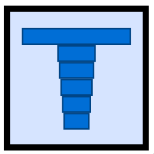
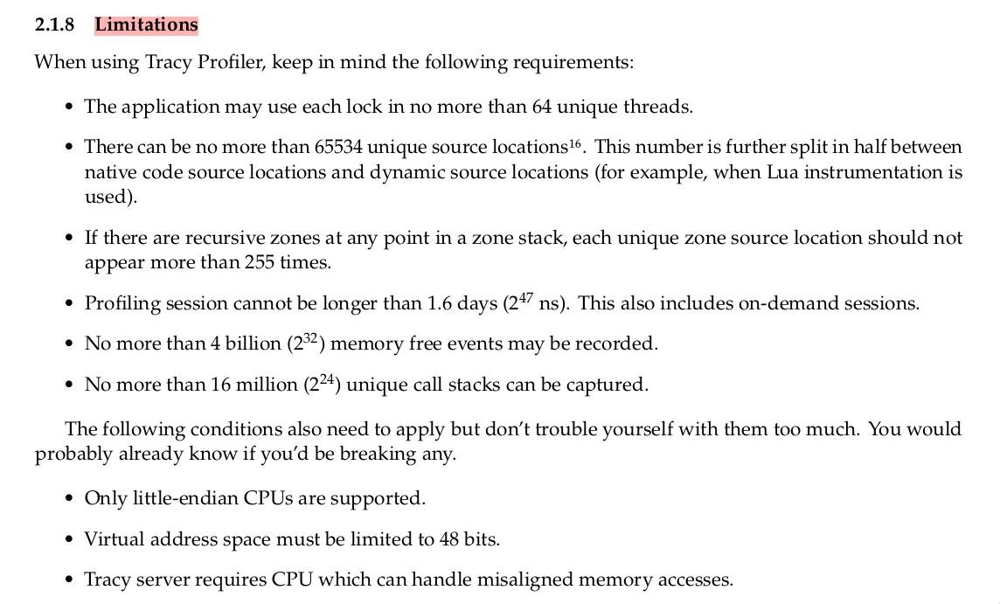
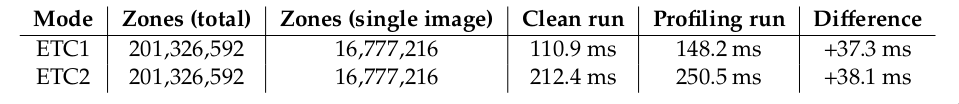
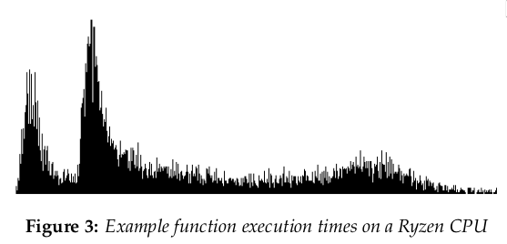

<style>
section {
  font-size: 26px; 
  text-align:left;
  background-repeat: no-repeat;
  background-position: bottom 20px left 20px;
  background-size: 150px auto;
}
section::after {
  --color-background-paginate: rgb(116, 140, 200);
  color: white;
  text-shadow: none;
  font-size: 20px;
}
</style>
<style scoped>
section { 
    font-size: 30px; 
    background-size: 0px;
    text-align:center;
}
</style>

# Our mutual friend, Tracy



Cambridge RSE Profiling Club
Fergus Baker 2024

---

## What is Tracy?

- Created by **Bartosz Taudul** ([@wolfpld](https://github.com/wolfpld))
- 3-clause **BSD** license
- **Sampling 🧪 / instrumentation 🎷 / frame 🖼️** based profiler
- Profiler primarily aimed for **video game** profiling
- **Real time**, with **remote telemetry**, up to nano-second accurate 🕓
- C++ native with a C API

[https://github.com/wolfpld/tracy/](https://github.com/wolfpld/tracy/)

---

## What is Tracy not?

- An MPI profiler 
- Geared for **HPC** or generally **multi-user** systems

---

## Tracy as high precision callipers

- Profiling a **single thread's workload**
- Examining **call-stacks** 🥞
- Threading strategies
- Branching behaviours
- Useable pretty much anywhere (even through WASM)
- Exploring the **layout** and execution of a code 🗺️

A useful tool 🔧 for the toolbox 🧰

---

## In this talk:

- Tracy **Idioms**
- Profiling **pitfalls to be weary of** with Tracy 😱
- Setting up Tracy
- Profiling **Hello World** 👋🌍
- **Demo 0**: Tracy and **MPI**
- **Demo 1**: profiling Zig app for quadrature integration
    - Using Tracy in other languages
    - Using the C API
- **Demo 2**: blind profiling [@ggerganov's llama.cpp](https://github.com/ggerganov/llama.cpp)
    - Learning an unfamiliar code base
    - Using the (significantly easier) C++ API

---

## Not in this talk:

- GPU profiling
- Memory profiling (via the Tracy `malloc/free` interface)
- Fibers (aka software thread-likes)
- Locks and mutexes

Check the [Tracy Manual](https://github.com/wolfpld/tracy/releases/latest/download/tracy.pdf) for this and so much more (93 pages)!

---

## For posterity:

- Best place to find **help** is in the Tracy Discord 💬
- There are not a huge number of examples out on the web: RTFM
- Bartosz has a [YouTube channel](https://www.youtube.com/@wolfpld) 👀
- Marcos Slomp did an [excellent CppCon 2023 talk](https://www.youtube.com/watch?v=ghXk3Bk5F2U)

---

# Tracy Idioms

---


### Concepts

Tracy is interactive, best for **instrumentation**

- **Zones**
    - Attach probes to the parts of the code you are interested in
    - Scoped
- **Plots** and **messages**
- **Frames** for tracking everything that has to happen to draw one frame on the screen in a **game**

---

Game development for scientists:

- A _frame_ is everything that has to happen to draw one frame on the screen ➡️ a frame is a **scoped section** of the computation 

**Example**: a single time step in an ODE solve, a snapshot step in a simulation, some setup ...

---

### Exploration idiom 🧭

Tracy helps us to learn a codebase

- **Interactivity** for exploration
- **Statistical sampling**: see call stacks and **what** is executed **when**
- **Markup instrumentation**: grants detail

---

### Debugging idiom 🪲

Real time profiling enables debugging strategies:

- Dynamically **enabling zones**: profile anomalies in greater detail
- **See** execution on threads, report with **plots**
- Memory profiling, and related tricks
- Messaging is **time** and **thread** aware
- Colors 🔴🟠🟡🟢🔵🟣

---

### Measurable improvements 📐

Tracy supports a **comparison** feature for comparing **zone** or **frame** execution

- Is also able to track some **source changes**

---

# Pitfalls

---

### Manual documents  limitations



---

### Tracy is _nearly_ zero overhead

Can still affect performance!



- approx 2.25 ns per zone
- can profile **small** tight loops
- Tracy profiles itself: determine the impact of measurement

---
<style scoped>
section { 
    text-align:center;
}
</style>

### Nanoseconds are quick

- Things might be out-of-order
- "Skid" in hardware counters
- CPU frequency sensitivity

 

---

### Other things to be aware of

- Tracy may send small source chunks back to the server
    - Careful when using **non-public codes**

- Everything is held in RAM
    - OOM

---

# Setup


---

## Building the tools

```bash
git clone https://github.com/wolfpld/tracy/ \
    && cd tracy
git checkout v0.10
cd profiler/build/unix
make -j release
```

\* Uses Wayland by default.
Build X11 with `make LEGACY=1 ...` 

---

## Including in your project

Compile a **release** build:

```make
$(CXX) -DTRACY_ENABLE=1 -O2 -march=native -c \
    $(TRACY_ROOT)/public/TracyClient.cpp -o TracyClient.o

...

$(CXX) -O2 -march=native -flto \
    -g -fno-omit-frame-pointer \
    main.c TracyClient.o -o ./main.out
```

- Include `tracy/Tracy.hpp` or `tracy/TracyC.h` (C API)
- `-DTRACY_ENABLE=1`

---

### Help Tracy understand your code

- compile with `-g` and `-fno-omit-frame-pointer` and link with `-rdynamic`

---


### Usage

Start profiler, run program (ideally as `root`)

- If for whatever reason cannot use graphical profiler
- **`capture` utility** is a headless way to save captures

---

# Hello World

---

# Demos

---

# Thanks 🤝🤠

https://github.com/wolfpld/tracy/